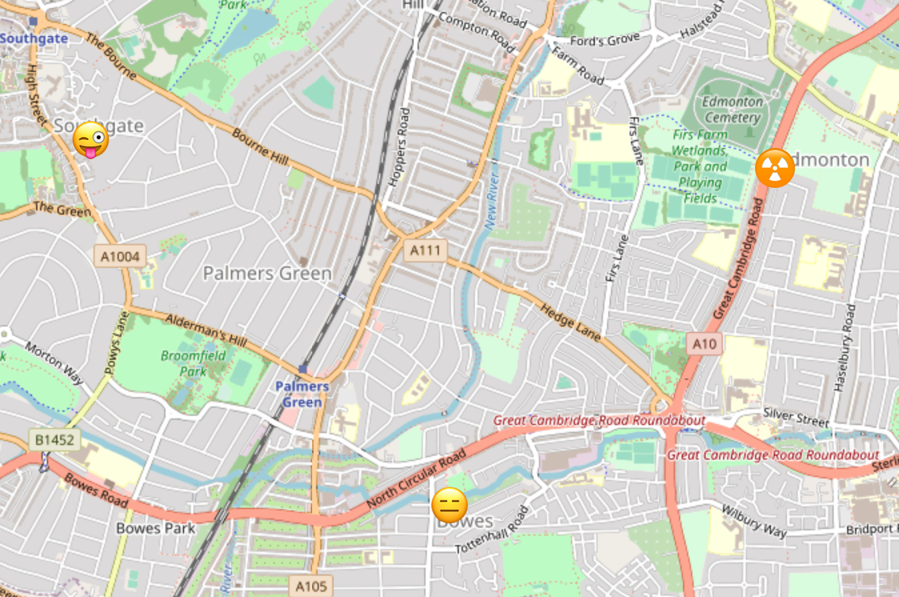

## What
Save emojis to a map!

## Why 

To learn react, node and redis 🤷

## How
* Maps from OpenStreetMap
* a React frontend using
    * react-leaflet for maps, markers
    * emoji-mart for choosing emojis
* Node backend REST API server
* Nginx as reverse proxy to the frontend, api server
* Redis for geospatial persistence

## Services

* front - reverse proxy
* web - frontend
* api - api server
* data - redis geospatial persistence

## Running

* Add `127.0.0.1 www.localhost` to `/etc/hosts`.
* Run `docker-compose up --build -d`
* Visit http://www.localhost

## Issues

There are many, please see [Issues](./issues).
